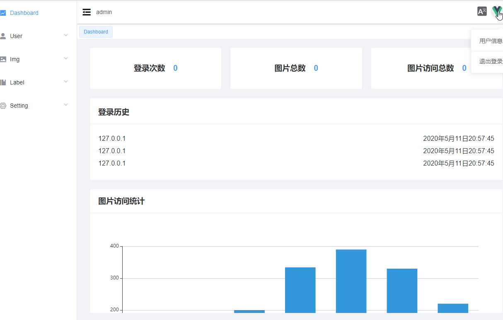

# vue-photo

## 后台首页



## 完成进度

- [*] 国际化
- [*] 数据库搭建初始化
- [*] 验证码以及接口
- [*] 登录界面以及接口
- [] 注册界面以及接口
- [*] 管理界面布局
- [*] app数据有关接口
- [*] user数据有关接口
- [*] img 数据有关接口
- [*] label 数据有关接口
- [] 修改logo
- [] 修改头像
- [] 上传页面
- [] 用户管理页面
- [] 设置页面
- [] 标签管理页面

## 目录

- docs 文档
- server 服务器
- web 前端

## 配置语言和加载element-ui语言

- 注意名字要和element-ui一样

```js
/**
 * @description 加载语言文件
 * @returns 语言message数组
 */
function loadLocaleMessages() {
  const locales = require.context('./lang', false, /[A-Za-z0-9-_,\s]+\.json$/i);
  const messages = {};
  locales.keys().forEach(key => {
    const matched = key.match(/([A-Za-z0-9-_]+)\./i);
    if (matched && matched.length > 1) {
      const locale = matched[1];
      const elementLocale = require(`element-ui/lib/locale/lang/${key.replace('./', '').replace('.json', '.js')}`);
      messages[locale] = Object.assign(elementLocale.default, locales(key));
    }
  });
  return messages;
}
```

## scss 路径

1. **~** 表示包路径
2. **~@** 表示跟路径 src

## find、filter、forEach、map 的用法区别

```js
const arr = [ 1, 2, 3 ];
// Array.find 返回通过测试数组的第一个元素的值
const findResult = arr.find((item, index, array) => {
  console.log('item: ', item, 'index: ', index); // 会打印三次
  return item.name === 'test2';
})
// Array.filter
// Array.forEach
// Array.map

```

## some 和 every 迭代的用法,返回true和false

- 用于判断是否数组中存在一个数组

```js
const arr = [
  { name: 'test0', age: '18' },
  { name: 'test1', age: '19' },
  { name: 'test2', age: '20' },
];

// Array.some  数组中如果 有一项 返回true，就true
const someResult = arr.some((item, index, array) => {
  console.log('item: ', item, 'index: ', index); // 会打印三次
  return item.name === 'test2';
});
console.log('some结果：', someResult); // true

// Array.every 数组中如果 每一项 返回true，就true
const everyResult = arr.every((item, index, array) => {
  console.log('item: ', item, 'index: ', index); // 只会打印一次,因为第一项就false所以直接退出了
  return item > 2;
});
console.log('every结果：', everyResult); // false
```

## 深拷贝路由循环导航（Breadcrumb）

- 一开始使用浅拷贝，导致使用splice更改了this.$route.matched数组

```js
this.navList = Object.assign([], this.$route.matched);
// 确认首页
if (this.navList[0].redirect && this.navList[0].redirect === this.navList[1].path) {
  this.navList.splice(1, 1); // 直接显示home
}
```

## vue-router 3.x  报错 Uncaught (in promise)问题

```js
import Router from 'vue-router'
const originalPush = Router.prototype.push
Router.prototype.push = function push(location, onResolve, onReject) {
  if (onResolve || onReject) return originalPush.call(this, location, onResolve, onReject)
  return originalPush.call(this, location).catch(err => err)
}
```

## node-svg img 引用加载失败，服务端设置响应头

```js
res.set('Content-Type', 'image/svg+xml;charset=UTF-8')
// or
res.type('image/svg+xml;charset=UTF-8')
```

## License

[MIT](./LICENSE) © HuaZhuangNan(花妆男)
